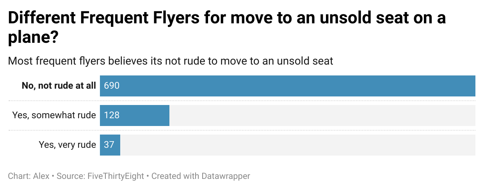

# Journ-124

This is the **Reason** why I choose _Different Frequent Flyers for move to an unsold seat on a plane?_

## reasons:

1. I like switching my seat if no one seats there and I dont know if people like that or not
2. My chart clearly shows that most people think this action is not rude at all, wtih a relatively high proportion
3. As you can see, the bar in the graph just goes super long for people think is not rude at all

## images:

